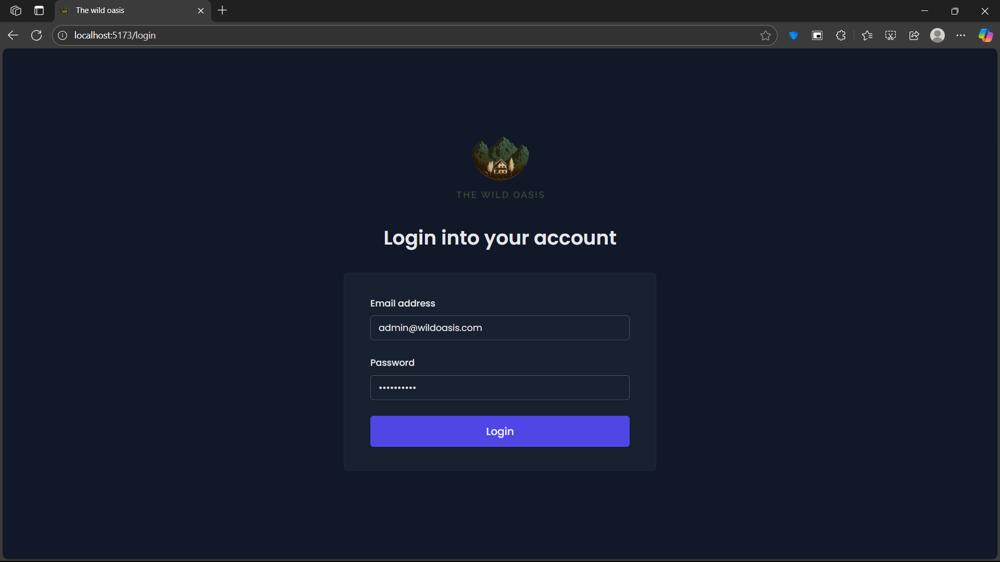
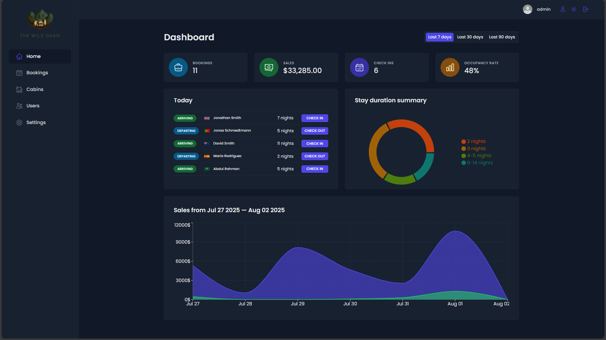
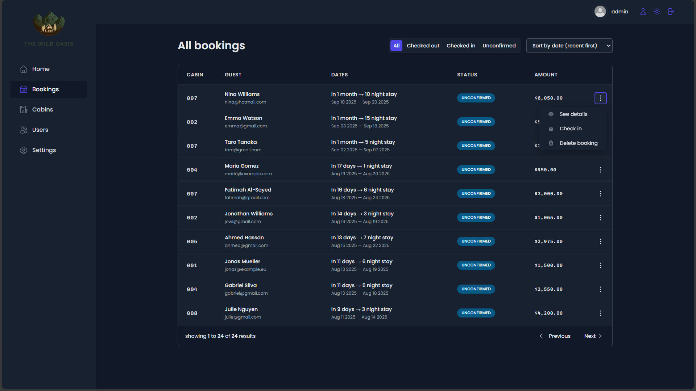
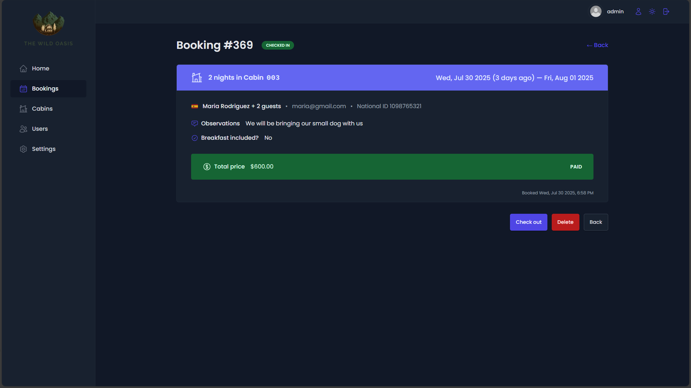
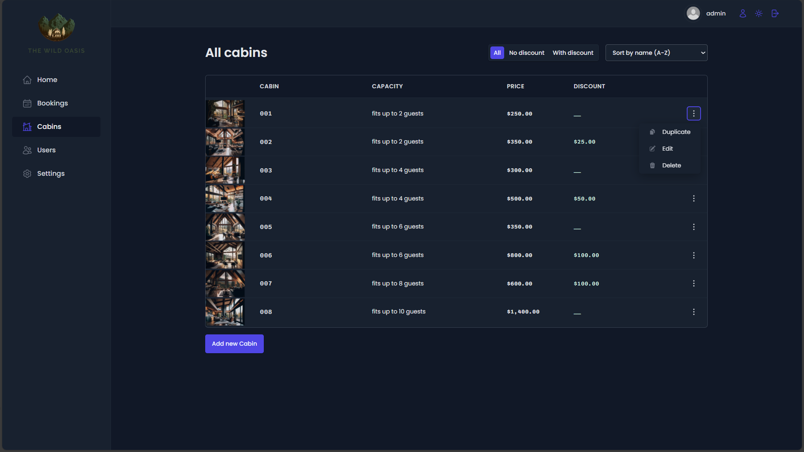
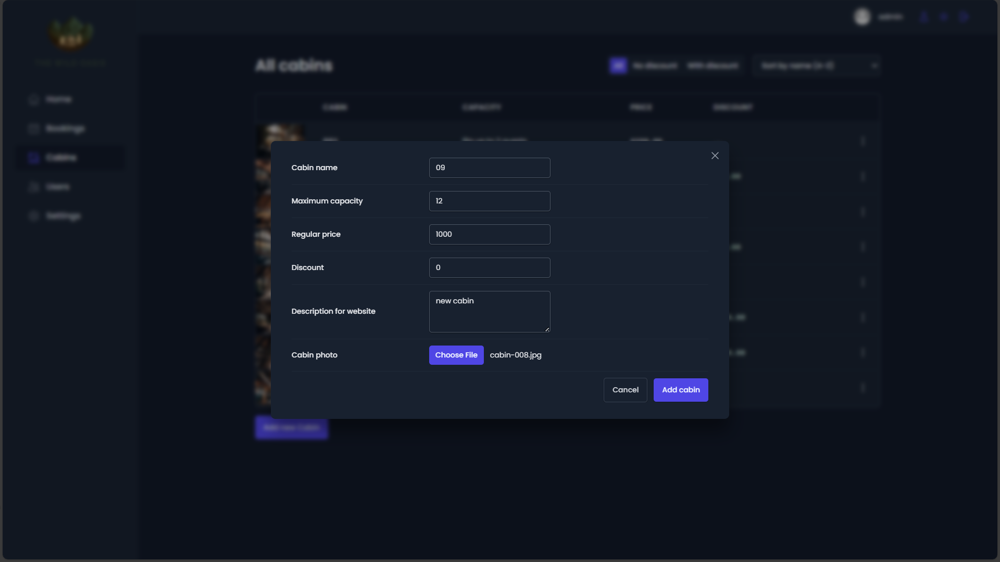
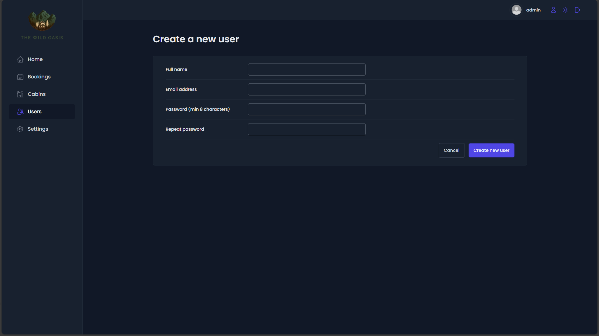
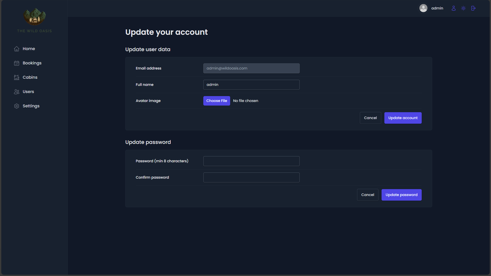

# Wild Oasis – Hotel Management Dashboard

**Wild Oasis** is a full-stack dashboard application designed to manage hotel operations efficiently and visually. It provides tools to monitor performance metrics, manage bookings, maintain cabin information, handle user accounts, and adjust hotel-wide settings.

## Table of Contents

- [Overview](#overview)
- [Features](#features)
- [Tech Stack](#tech-stack)
- [Project Structure](#project-structure)
- [Pages and Functionalities](#pages-and-functionalities)
- [Installation](#installation)
- [Usage](#usage)
- [Screenshots](#screenshots)
- [Contributing](#contributing)

## Overview

Wild Oasis is a hotel management dashboard that enables administrators to view real-time data, manage bookings and cabins, create and update users, and configure hotel settings. It is built using modern front-end technologies and powered by Supabase for authentication, database management, and storage.

The project follows a modular architecture and prioritizes maintainability, scalability, and user experience.

## Features

- Real-time dashboard displaying:

  - Total bookings
  - Total sales (USD)
  - Number of check-ins
  - Occupancy rate
  - Summary of today’s reservations, check-ins, check-outs, and average stay duration

- Booking management with:

  - Status filters (Check-in, Check-out, Unconfirmed)
  - Sorting (by date or amount)
  - Pagination
  - Detailed booking view
  - Booking creation, check-in, and deletion

- Cabin management including:

  - Filters (All, With Discount, Without Discount)
  - Sorting (by name, price, capacity)
  - Add, duplicate, edit, and delete cabin entries

- User and profile management:

  - Admin can create users
  - Users can update their profile, avatar, and password

- Hotel-wide settings configuration:

  - Minimum and maximum nights per booking
  - Maximum guests per booking
  - Breakfast price

- Light and dark mode toggle

## Tech Stack

**Frontend:**

- React.js
- React Router DOM
- React Query
- React Hook Form
- Styled Components
- Recharts

**Backend (via Supabase):**

- Supabase Database (PostgreSQL)
- Supabase Auth
- Supabase Storage

## Project Structure

```
/src
├── context/           # Theme context
├── components/        # Reusable UI components
├── features/          # Feature-based modules (bookings, cabins, etc.)
├── hooks/             # Custom React hooks
├── services/          # API and Supabase logic
├── ui/                # UI design system and styled components
├── utils/             # Helper functions and utilities
├── App.jsx
└── main.jsx
```

## Pages and Functionalities

### Dashboard

Displays a summary of hotel activity including key performance indicators and visual charts representing check-in/check-out behavior and stay durations.

### Bookings

Displays detailed information about each reservation, including guest details, stay duration, cabin number, price, and special notes. It allows hotel staff to check out guests, delete bookings, or return to the main list. Payment status and reservation history are clearly highlighted for quick reference and efficient management.

### Booking

Allows filtering by booking status, sorting by amount or date, and navigating through pages. Users can view details, check-in guests, delete bookings, and create new ones.

### Cabins

Lists all cabins with the ability to filter by discount status, sort by multiple criteria, and perform CRUD operations.

### Profile

Authenticated users can update their personal information including name, avatar, and password.

### Settings

Hotel settings can be adjusted including night limits, guest capacity, and breakfast pricing. Supports theme switching between light and dark modes.

---

## Installation

Clone the repository and install dependencies:

```bash
git clone https://github.com/your-username/wild-oasis.git
cd wild-oasis
npm install
```

---

## Usage

Start the development server:

```bash
npm run dev
```

Build the application for production:

```bash
npm run build
```

## Screenshots

Use the following syntax to embed them if needed:










## Contributing

Contributions, issues, and feature requests are welcome. Before contributing, please open a discussion or issue to align on goals and implementation plans.
